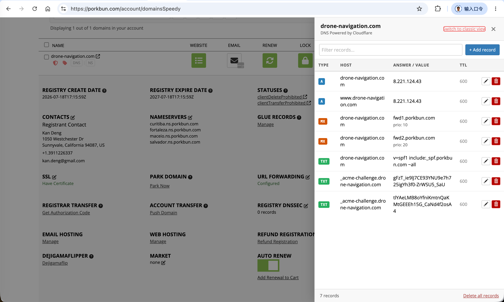
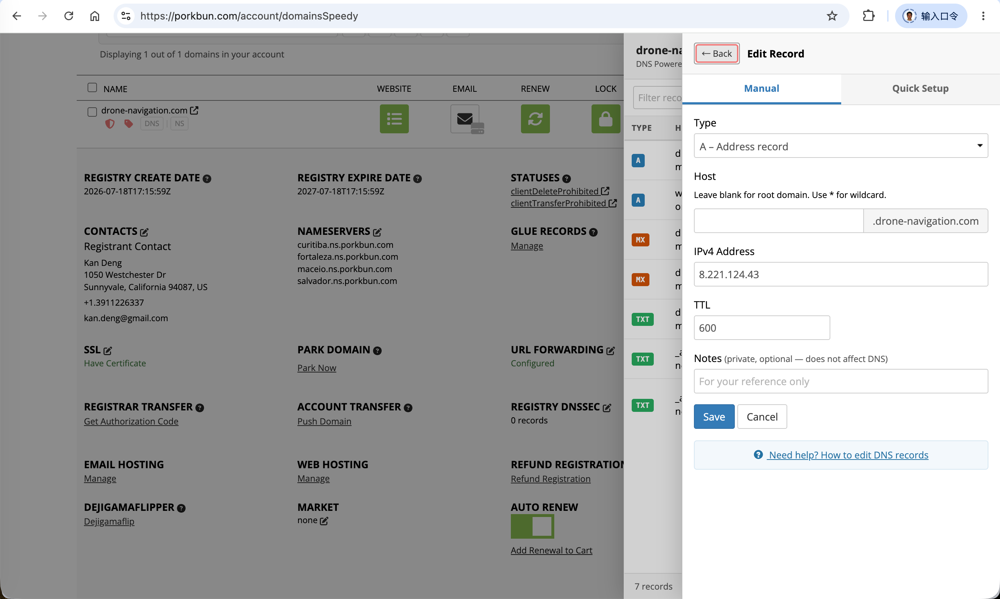
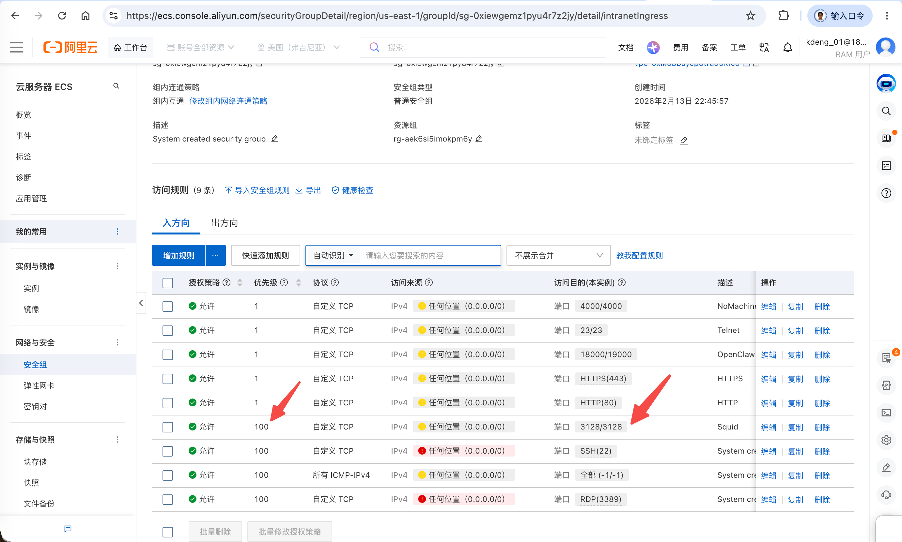

# Drone\-navigation Website

This document describes how the `drone-navigation` project is deployed and operated in production.


# 1. Domain Name

## 1.1 Porkbun Domain Name Registrar

The domain `drone-navigation.com` is registered through [Porkbun](https://porkbun.com/).

Use Porkbun to manage DNS records (A/AAAA/CNAME) that point the domain to the Alibaba Cloud ECS instance. Screenshots of the Porkbun DNS configuration are attached below for reference.






&nbsp;
## 1.2 Alibaba Cloud

The production server runs on an Alibaba Cloud ECS instance (Ubuntu 24.04.4 LTS).

**Login portal**

```plain
URL:      https://signin.aliyun.com/
```

### 1. Network security group

Ensure the ECS security group allows inbound traffic on the ports used by the services:

| Port | Protocol | Purpose                |
|------|----------|------------------------|
| 22   | TCP      | SSH remote access      |
| 80   | TCP      | HTTP (Caddy)           |
| 443  | TCP      | HTTPS (Caddy)          |
| 3128 | TCP      | Squid HTTPS proxy      |

A screenshot of the security group rules is attached below.




&nbsp;
### 2. CDN

CDN configuration is not currently used. If needed in the future, configure an Alibaba Cloud CDN distribution in front of Caddy and point its origin to the ECS public IP or `www.drone-navigation.com`.


&nbsp;
# 2. Frontend Servers

## 2.1 Caddy Web Engine

### 1. Caddy Installation

Install Caddy on Ubuntu using the official Cloudsmith repository.

```bash
# 1. Update system packages and install prerequisites
sudo apt update && sudo apt install -y ca-certificates curl gnupg

# 2. Install additional apt tooling for third-party repositories
sudo apt install -y debian-keyring debian-archive-keyring apt-transport-https curl

# 3. Add the official Caddy GPG key
curl -1sLf 'https://dl.cloudsmith.io/public/caddy/stable/gpg.key' | \
  gpg --dearmor -o /usr/share/keyrings/caddy-stable-archive-keyring.gpg

# 4. Add the official Caddy apt repository
curl -1sLf 'https://dl.cloudsmith.io/public/caddy/stable/debian.deb.txt' | \
  tee /etc/apt/sources.list.d/caddy-stable.list

# 5. Update package lists and install Caddy
sudo apt update
sudo apt install caddy -y

# 6. Verify installation and service status
caddy version
sudo systemctl status caddy
```

If the GPG key download fails due to DNS or network issues, check `/etc/resolv.conf` and retry from a stable connection.


&nbsp;
### 2. drone\-navigation deployment

Build the Vue frontend and deploy it behind Caddy.

```bash
# 1. Clone the repository
cd ~
git clone https://github.com/kandeng/drone-navigation.git
cd drone-navigation/client/

# 2. (Optional) Upgrade npm if needed
npm install -g npm@11.12.1

# 3. Install dependencies and build the production bundle
npm install
npm run build

# 4. Configure API keys
# Edit client/config.json with your Google Maps API key and Cesium Ion token.
vim config.json

# 5. Re-build after configuration changes
npm run build

# 6. Create the web root directory and copy the built assets
sudo mkdir -p /var/www/drone-navigation/client/dist
sudo cp -r ~/drone-navigation/client/dist/* /var/www/drone-navigation/client/dist/

# 7. Deploy the runtime config.json (this file is gitignored and must be copied manually)
sudo cp ~/drone-navigation/client/config.json /var/www/drone-navigation/client/dist/config.json
```

After copying the files, configure Caddy (see the next section) and reload the service:

```bash
sudo systemctl reload caddy
sudo systemctl status caddy
```

To inspect Caddy logs:

```bash
sudo journalctl -u caddy -f
```


&nbsp;
### 3. Caddy configuration

Create or edit `/etc/caddy/Caddyfile` to serve the built frontend. Caddy will automatically provision and renew HTTPS certificates for the listed domains.

See [`deployment/caddy/Caddyfile`](file:///home/robot/drone-navigation/deployment/caddy/Caddyfile) for the full configuration.

After editing:

```bash
# Format the Caddyfile (optional but recommended)
caddy fmt --overwrite /etc/caddy/Caddyfile

# Reload Caddy to apply the new configuration
sudo systemctl reload caddy
sudo systemctl status caddy
```


&nbsp;
## 2.2 Squid Proxy

### 1. Squid Installation

Install Squid on the same Ubuntu server:

```bash
sudo apt update
sudo apt install -y squid openssl

# Verify installation
squid -v

# Create directories for TLS certificates and passwords
sudo mkdir -p /etc/squid/certs
sudo mkdir -p /var/log/squid
sudo mkdir -p /var/spool/squid

# (Optional) Create a self-signed certificate for HTTPS proxy testing
# In production, use Let's Encrypt or another trusted CA.
sudo openssl req -x509 -nodes -days 365 -newkey rsa:2048 \
  -keyout /etc/squid/certs/www.drone-navigation.com.key \
  -out /etc/squid/certs/www.drone-navigation.com.crt \
  -subj "/CN=www.drone-navigation.com"
```


&nbsp;
### 2. Squid Configuration

Edit `/etc/squid/squid.conf` to enable an authenticated HTTPS proxy on port `3128`.

See [`deployment/squid/squid.conf`](file:///home/robot/drone-navigation/deployment/squid/squid.conf) for the full configuration.

After editing, validate and restart Squid:

```bash
sudo squid -k parse
sudo systemctl restart squid
sudo systemctl status squid
```

&nbsp;
### 3. Squid Passwords

Create and manage the password file used by Squid's basic authentication helper.

```bash
# 1. Generate an htpasswd-compatible hash for the user
openssl passwd -apr1 <your-plain-password>

# 2. Create /etc/squid/passwords with the username and hashed password.
# The format is:  username:hash
# Example (replace <hash> with the output from the previous command):
echo "<your-username>:<hash>" | sudo tee /etc/squid/passwords

# 3. Verify the credentials against the password file
echo "<your-username> <your-plain-password>" | /usr/lib/squid/basic_ncsa_auth /etc/squid/passwords
```

If the verification prints `OK`, authentication is configured correctly. Make sure the file is readable by the Squid process:

```bash
sudo chmod 640 /etc/squid/passwords
sudo chown root:proxy /etc/squid/passwords
```


&nbsp;
### 4. Squid Usage

Test the HTTPS proxy from a MacBook or Ubuntu desktop using `curl`:

```bash
# Without authentication (expected to fail with 407)
curl --proxy-insecure -x https://www.drone-navigation.com:3128 -I https://www.google.com

# With inline authentication
curl --proxy-insecure -x https://<proxy-user>:<proxy-password>@www.drone-navigation.com:3128 -I https://www.google.com
```

A successful request returns:

```plain
HTTP/1.1 200 Connection established
HTTP/2 200
...
```

**Known platform notes**

- **iOS / macOS**: Direct OS-level HTTPS proxy settings are strict and often reject self-signed certificates. Both iPhone and MacBook may fail to use `drone-navigation.com:3128` when configured in system network settings.
- **macOS (Clash Verge)**: You can theoretically route traffic through Clash Verge pointing at `drone-navigation.com:3128`, but configuration is challenging.
- **Ubuntu**: Setting the proxy server is straightforward, but providing authenticated credentials at the OS level can be tricky.
- **Windows / Android**: Not yet tested.


&nbsp;
# 3. Backend Servers

## 3.1. Fastapi Backend

The FastAPI backend is a planned component for server-side logic (e.g., mission persistence, telemetry ingestion, user accounts). It is not yet implemented.

Planned deployment outline:

```bash
# 1. Install Python dependencies
cd /home/robot/drone-navigation/server
pip install -r requirements.txt

# 2. Configure server/config.json from config.example.json

# 3. Start the FastAPI server (adjust host/port as needed)
# uvicorn main:app --host 0.0.0.0 --port 8000
```

Once running, uncomment the `/api/*` reverse-proxy block in [`deployment/Caddy/Caddyfile`](file:///home/robot/drone-navigation/deployment/Caddy/Caddyfile) so Caddy forwards API requests to the backend.


&nbsp;
## 3.2. Openclaw Assistant

Openclaw Assistant integration is planned but not yet implemented. This section will document how to deploy and configure the assistant service once the integration is ready.


&nbsp;
## 3.3. Synapse Matrix

Synapse Matrix integration is planned but not yet implemented. This section will document how to deploy and configure the Matrix homeserver once the integration is ready.


&nbsp;
# 4. Data Sources

## 4.1. Google Map APIs

&nbsp;
## 4.2. Cesium Ion